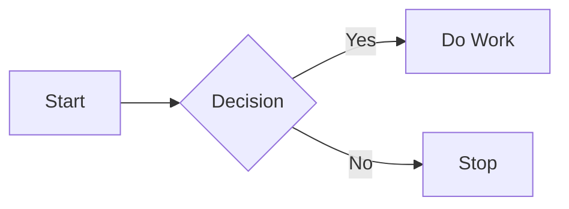
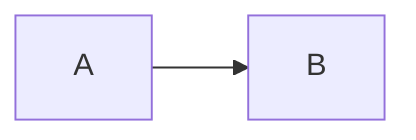

# markandrewbender.github.io
Marks Thoughts




#### 2. Math Equations (KaTeX) 
GitHub supports mathematical notation. 
```markdown
 $$
 \frac{dv(t)}{dt} = -\alpha v(t) + \beta e^{-t/\tau}
 $$


- [ ] Design Review
- [x] Architecture Review
- [ ] FMEA Review


<details>
<summary>Folded up list</summary>
 
- [ ] Design Review
- [x] Architecture Review
- [ ] FMEA Review
</details>
